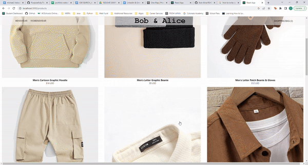
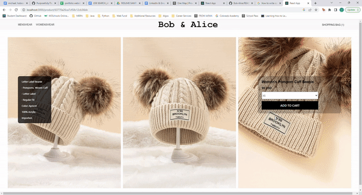
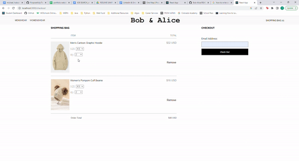
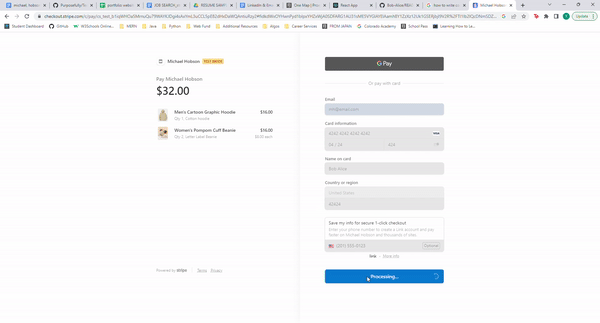

<!-- PROJECT LOGO -->
<br />
<div align="center">
  <a href="https://github.com/Flamingoo22/Bob-Alice" name="readme-top">
    <h1>Bob & Alice E-Commerce Web App</h1>
  </a>
  
  <p align="center">
    An e-commerce website for fashion clothing!
    <br />
    <a href="https://github.com/Flamingoo22/Bob-Alice"><strong>Explore the docs »</strong></a>
    <br />
    <br />
    <a href="https://github.com/Flamingoo22/Bob-Alice">View Demo</a>
  </p>
</div>


<!-- TABLE OF CONTENTS -->
<details>
  <summary>Table of Contents</summary>
  <ol>
    <li>
      <a href="#about-the-project">About The Project</a>
      <ul>
        <li><a href="#built-with">Built With</a></li>
      </ul>
    </li>
    <li>
      <a href="#getting-started">Getting Started</a>
      <ul>
        <li><a href="#prerequisites">Prerequisites</a></li>
        <li><a href="#installation">Installation</a></li>
      </ul>
    </li>
    <li><a href="#contact">Contacts</a></li>
    <li><a href="#acknowledgments">Acknowledgments</a></li>
  </ol>
</details>


<!-- ABOUT THE PROJECT -->
## About The Project

<p>
This project was created so that two new developers could work together in a collaborative way from start to finish. Prior to this, we had both worked individually on projects, but we wanted to gain experience working in tandem to receate a real-world team scenario. We also had the goal of becoming more experienced in working together within a Github repository.  

As part of our ideation process, we quickly settled on an e-commerce web app. We saw tremendous value in the flexibility and scalability of that style of app, and we wanted to create something that could be the foundation for a variety of different web apps in the future. Our project was built utilizing the agile development process. This included a planning meeting, daily stand-up meetings, and the development of user stories via Trello to build out our features. The planning process also included full visual concept wireframes designed in balsamiq.
  
We selected a clothing app as it would be visually appealing and versatile enough for us to build universal features. The simple and clean style of the app was based off of research done on the current landscape of similar apps, and allowed for some creative useage of CSS and Material UI. The backend development incorporated the StripeAPI payment system as it is one of the more widely used APIs, and provides excellent developer tools for testing and implementation.
  
This full-stack MERN project was completed as part of our coding bootcamp Project Week with all work completed in six days. We were excited to present it to our cohort, and proud that the group selected the project to be one of just three presented at our graduation.
</p>












<p align="right">(<a href="#readme-top">back to top</a>)</p>


### Built With

This section lists any major frameworks/libraries used in our project.

* 
* 
* 
* 
* 
* 
* 
* 

<p align="right">(<a href="#readme-top">back to top</a>)</p>


<!-- GETTING STARTED -->
## Getting Started

To get a local copy up and running follow these simple example steps.

### Prerequisites

Inside the project directory, Run the server
* nodemon
  ```sh
  nodemon server.js
  ```
Open a new terminal and move into the client folder, and start the react app
* npm
  ```sh
  cd client
  npm run start
  ```

### Installation

_Below is an example of how you can instruct your audience on installing and setting up your app. This template doesn't rely on any external dependencies or services._

1. Get a free API Key at [https://dashboard.stripe.com/test/dashboard](https://dashboard.stripe.com/test/dashboard)
2. Clone the repo
   ```sh
   git clone https://github.com/Flamingoo22/Bob-Alice
   ```
3. Install NPM packages
   ```sh
   npm install
   ```
4. Create and .env file and enter your Stripe secret API key
   ```js
   STRIPE_KEY = 'ENTER YOUR SECRET_KEY';
   ```

<p align="right">(<a href="#readme-top">back to top</a>)</p>


<!-- CONTRIBUTING -->
## Contributing

Contributions are what make the open source community such an amazing place to learn, inspire, and create. Any contributions you make are **greatly appreciated**.

If you have a suggestion that would make this better, please fork the repo and create a pull request.

1. Fork the Project
2. Create your Feature Branch (`git checkout -b feature/AmazingFeature`)
3. Commit your Changes (`git commit -m 'Add some AmazingFeature'`)
4. Push to the Branch (`git push origin feature/AmazingFeature`)
5. Open a Pull Request

<p align="right">(<a href="#readme-top">back to top</a>)</p>


<!-- CONTACT -->
## Contacts

* Yifan Qiu - [@Linkedin](https://www.linkedin.com/in/yifan-qiu-9813bb232/) - yif.chu22@gmail.com
* Michael Hobson - [@Linkedin](https://www.linkedin.com/in/michaelghobson/) - mikehobson@outlook.com

Project Link: [https://github.com/Flamingoo22/Bob-Alice](https://github.com/Flamingoo22/Bob-Alice)

<p align="right">(<a href="#readme-top">back to top</a>)</p>


<!-- ACKNOWLEDGMENTS -->
## Acknowledgments

This ReadME page is created using the template below:

* [README_Template](https://github.com/othneildrew/Best-README-Template/blob/master/README.md)

<p align="right">(<a href="#readme-top">back to top</a>)</p>
